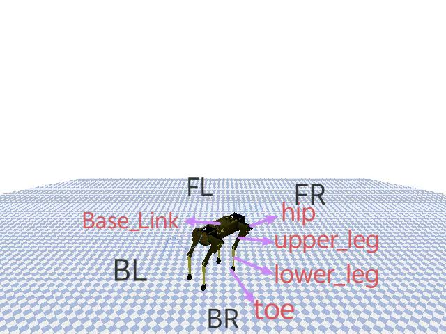

# 落体猫运动

## 运行

**方法一**:双击run.bat。（不支持调试）

**方法二**:（不支持调试）

- 进入src目录下
- cmd运行`mycat\Scripts\activate`
- 运行主文件`python DroppingCat.py`

**方法三**：

- 使用vscode或者pycharm等IDE打开src选择python环境mycat，然后运行DroppingCat.py

## 操作

- F/J/B/N  前进/后退/上/下
- Q/E/A/D 下旋/上仰/左转/右转
- W/G/V/其他功能
- 空格键 暂停/继续
- R 重置摄像视角
- 鼠标强制拖动(不推荐)
- RESET_Height 每次猫重置后的高度
- Max_Velocity 猫的速度超过此值系统自动结束
- Begin_Collision 允许猫落地(用于生成一次报告，获取反冲力)（划到右侧开启）
- Auto_Collision 开启随机动画（划到右侧开启）
- Quit 退出

## 功能

1. 实时调整猫的各个关节（合理范围内）
2. 进行随机动画
3. 支持输入图表时间轴长度
4. 实时显示猫下落过程的线速度、角速度，多方向(x/y/z/角速度方向)转动惯量评估旋转状态)
5. 支持实时调试、暂停、设置重置高度
6. 支持每次正式测试计算落地冲力，并生成报告
7. 由于python性能低下，**不支持实时录制和截图**(否则卡成ppt,Recorder.py已经停用)， 但是绘图结果支持手动截图保存(窗口左下角)，与手动录制(提供软件包)进行时间上的校对，便可查看特定时间点猫的姿态

## 项目说明

### 主要第三方库

- pybullet 充当物理引擎和进行GUI窗口实时渲染
- matplotlib 绘图
- noise 用于随机动画算法

### 猫的结构

  

**其中**:

- F/B/L/R: 前后左右
- toe是固定关节，不可调整;Base_Link是身体，也不可调节
- 长/宽/高:0.3m/0.15m/0.2m(粗略值)
- 关节质量：0.1~0.4kg;身体质量:3kg。

